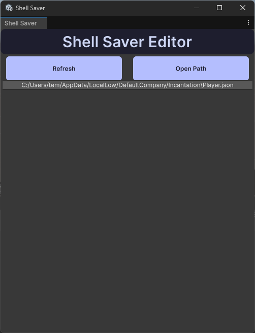

# Installation
Drag the `ShellSaver.unitypackage` file into your Unity project.

That's it!

Note: If you're using asmdef files, you will have to add the `ShellSaver` assembly definition to your asmdefs.

# Usage

You can save a script by doing the following in code:
```csharp
ShellSaver.Save(gameData, "Game Data"); // "Game Data.json" will be the name of the file
```

If you don't want your file to be overwritten, you can do the following:
```csharp
ShellSaver.Save(gameData, "Game Data", false);
```

You can load a script by doing the following in code:
```csharp
var gameData = ShellSaver.Load<GameData>("Game Data");
```

You can delete a saved file by doing the following in code:
```csharp
ShellSaver.Delete("Game Data");
```

You can get all saved files by their file location by doing the following in code:
```csharp
IEnumerable<string> savedFiles = ShellSaver.ListSaves();
```

And you can delete all saved files by doing the following in code:
```csharp
ShellSaver.Clear();
```

Note: The `GameData` class/struct must be serializable.

# Editor Tools
You can also view and edit saves in the editor by going to `Tools > Shell Save`.

Your save will look like the following:



`Refresh` will refresh the list of saves.

`Open Path` will open the path of the persistent data path.

Clicking on a save will edit the save in your default text editor/IDE.